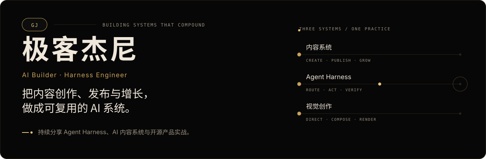
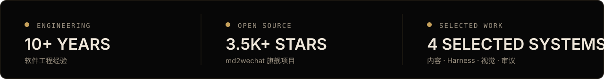
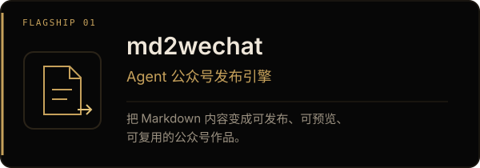
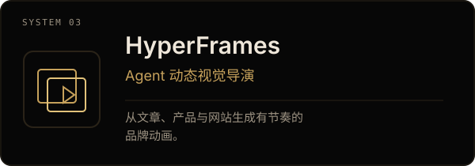
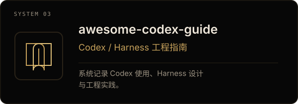
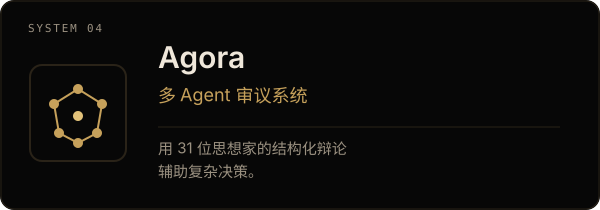

  

 

## 代表作品

<table>
  <tr>
    <td width="50%" valign="top">
      
       
      
    </td>
    <td width="50%" valign="top">
      
       
      
    </td>
  </tr>
  <tr>
    <td width="50%" valign="top">
      
       
      
    </td>
    <td width="50%" valign="top">
      
       
      
    </td>
  </tr>
</table>

## 联系与合作

需要把内容创作、发布和增长做成系统？

**内容增长系统 · Agent 工程 · 产品定制**

[jieni.ai](https://jieni.ai) · [X @seekjourney](https://x.com/seekjourney) · 公众号：**极客杰尼**
